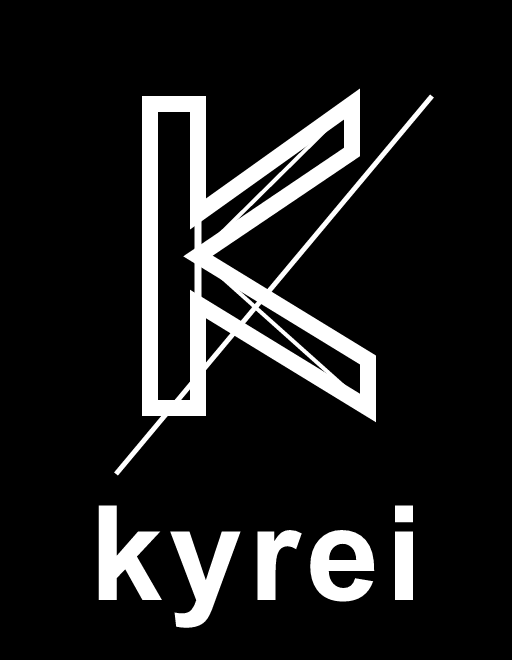

# Kyrei

<p align="center">
  
</p>

<p align="center">
  Локальный кросс-платформенный AI-агент для разработки: собственный движок,
  оркестрация команд, провайдеры без жёстких ограничений и desktop-first UX.
</p>

## Возможности

- Локальный TypeScript/Node-движок с потоковыми ответами и проверяемыми инструментами.
- Неограниченное число OpenAI-, Anthropic- и Google-совместимых провайдеров.
- Пулы аккаунтов с балансировкой, session affinity и назначением аккаунтов на модели.
- Team mode и pipeline-команды для исследования, реализации, ревью и тестирования.
- Проектная память, skills, cron-задачи, встроенные инструменты поиска и чтения страниц.
- Официальный Kiro CLI-коннектор для browser/device авторизации и обнаружения моделей.
- Отдельный защищённый Kiro Organization-пул для принадлежащих организации API-ключей,
  изолированных профилей, project/model policies, проверки аккаунтов и discovery моделей.
- Полная локализация интерфейса на русском и английском.

## Скачать

Готовые сборки находятся в [последнем GitHub Release](https://github.com/dizzzable/Kyrei/releases/latest).

| Платформа | Артефакты |
| --- | --- |
| Windows x64 | NSIS Setup и Portable `.exe` |
| macOS Intel | `.dmg` и `.zip` |
| macOS Apple Silicon | `.dmg` и `.zip` |
| Linux x64/arm64 | AppImage и `.deb` |
| Arch Linux x64 | `.pkg.tar.zst` для `pacman` |

Для Linux и Arch: [`sudo` нужен только для установки, а запуск — обычной
учётной записью](docs/linux-launch.md). Не используйте `sudo kyrei` и не
добавляйте `--no-sandbox`.

Каждый релиз содержит `SHA256SUMS.txt`. Пока проект не получил сертификаты
Microsoft и Apple, Windows- и macOS-сборки публикуются без доверенной подписи и
нотаризации, поэтому ОС может показать предупреждение.

## Быстрый старт для разработки

Требуется Node.js 22 или новее.

```bash
npm ci
npm run gate
npm start
```

Основные команды:

```bash
npm run gate             # typecheck, JS/i18n checks и Vitest
npm run build            # production-сборка renderer
npm run dist:win         # Windows x64
npm run dist:mac:x64     # macOS Intel
npm run dist:mac:arm64   # macOS Apple Silicon
npm run dist:linux:x64   # AppImage, DEB и Arch package
npm run dist:linux:arm64 # AppImage и DEB для ARM64 runner
npm run dist:arch        # только Arch Linux package
```

Из-за нативных `better-sqlite3` и `sqlite-vec` релизные пакеты собираются на
нативных GitHub runners соответствующей ОС и архитектуры.

## Провайдеры и аккаунты

Kyrei не привязывает пользователя к штатному облаку. Можно подключать готовые
профили или создавать собственные провайдеры с base URL, API-ключом и каталогом
моделей. Для каждого аккаунта в пуле задаётся доступ ко всем моделям, выбранным
моделям или режим без генерации.

Kiro Organization работает отдельным контуром и не импортирует глобальную
browser-сессию Kiro CLI. Каждый организационный аккаунт получает собственный
`KIRO_HOME`, API-ключ хранится в OS-backed secret store и передаётся только
официальному headless CLI. На текущем этапе доступны управление пулом, проверка
ключа и discovery моделей; transport выполнения задач подключается отдельным
защищённым этапом.

OAuth/device авторизация рассматривается как управляемый token broker: refresh
credentials должны храниться только в защищённом core-хранилище, access tokens —
быть короткоживущими, а отключение аккаунта должно немедленно прекращать новые
выдачи. Подробности: [модель безопасности account broker](docs/security/account-token-broker.md).

## Архитектура

- `core/engine/` — локальный движок агента и инструменты.
- `core/gateway.js` — capability-защищённый HTTP/SSE шлюз renderer ↔ core.
- `core/provider-account-pool.js` — маршрутизация аккаунтов и моделей.
- `core/kiro-organization-*.js` — изолированный организационный Kiro broker и CLI worker.
- `electron/` — desktop-оболочка без встроенного общего браузера.
- `src/` — React-интерфейс и EN/RU локализация.

Renderer не получает API-ключи, OAuth-токены или raw identity. Авторизация
открывает системный браузер либо использует device code.

## Release

Push тега `v*` запускает `.github/workflows/package-desktop.yml`: сначала полный
gate и secrets scan, затем нативные сборки Windows/macOS/Linux/Arch, генерация
SHA-256 и публикация GitHub Release.

## Лицензия

[MIT](LICENSE)
