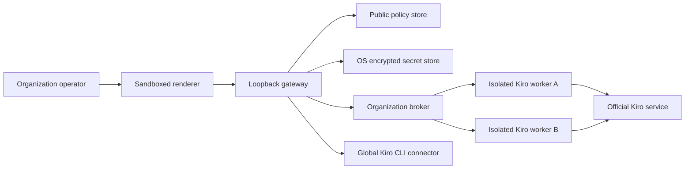

# Kiro Organization broker threat model

## Executive summary

The Kiro Organization broker is a local-desktop control plane for routing work
across organization-owned Kiro API keys. Its highest-risk boundaries are the
renderer-to-gateway credential write, OS-backed secret persistence, and the
official `kiro-cli` child process. The first delivery deliberately excludes
private Kiro endpoints, refresh-token imports, browser-cookie extraction, and
shared browser identities. Every account receives an isolated `KIRO_HOME`, one
active lease at a time, an explicit model/project policy, and revocable runtime
generation fencing.

## Scope and assumptions

In scope:

- `electron/main.js` and the local gateway bootstrap.
- `core/gateway.js` and its loopback capability boundary.
- `core/kiro-cli-connector.js` as the existing, separate global-identity
  control plane.
- `core/kiro-organization-config.js`,
  `core/kiro-organization-broker.js`, and
  `core/kiro-organization-worker.js`.
- `core/provider-account-pool.js` as a credential-free scheduler.
- Kiro Organization settings UI and gateway client methods under `src/`.

Out of scope for this phase:

- Direct calls to undocumented Kiro or Amazon Q endpoints.
- Importing Kiro CLI databases, Kiro-Go configuration, cookies, access tokens,
  refresh tokens, or client secrets.
- Embedded sign-in pages and account-scoped browser/device login.
- A remotely hosted or multi-tenant Kyrei gateway.
- Pooling personal subscriptions or switching accounts to bypass a hard quota.

Assumptions validated from the product requirements in this task:

- Kyrei remains a local Windows, macOS, and Linux desktop application; its
  gateway is not intentionally exposed to the LAN or Internet.
- Accounts and API keys are owned or explicitly managed by the organization.
- Administrators need central disable/revoke controls and project/model
  attribution; employees must not receive the upstream secret.
- The first executable transport uses the official Kiro CLI headless API-key
  mode. The existing browser identity remains global and separate.
- A hard upstream quota is an entitlement boundary, not a retry signal that
  permits automatic evasion.

Open questions for later phases:

- Whether an enterprise deployment needs a distinct administrator role beyond
  the current local OS user and per-launch gateway capability.
- Which stable, non-PII organization principal identifier Kiro can expose for
  API-key verification.
- Whether a future official ACP transport guarantees concurrent access to one
  `KIRO_HOME`; until then, concurrency is fixed to one per account.

## System model

### Primary components

- The sandboxed Electron renderer collects public policy and a write-only API
  key. Evidence: `electron/main.js` (`contextIsolation`, `sandbox`, navigation
  and popup denial) and `src/components/settings/providers/`.
- The loopback gateway authenticates every request with a random per-launch
  capability and validates origin/host before routing. Evidence:
  `core/gateway.js` (`tokenMatches`, `isLoopbackHost`, request gate).
- The configuration boundary separates public account metadata from encrypted
  credential envelopes. Evidence: `core/gateway.js`
  (`createGatewayConfigPersistence`) and `electron/main.js`
  (`createSecretsCodec`).
- `KiroOrganizationBroker` owns policy eligibility, account leases, cooldown,
  verification state, generation fencing, and secret-to-worker handoff.
- `KiroOrganizationWorker` resolves an absolute official CLI binary, requires
  a patched minimum version, creates an account-scoped `KIRO_HOME`, and puts the
  API key only in the child environment.
- The existing `KiroCliConnector` continues to represent one OS-global browser
  identity and never joins the organization pool. Evidence:
  `core/kiro-cli-connector.js` (`KIRO_CLI_ACCOUNT_CAPABILITIES`).

### Data flows and trust boundaries

- Operator -> renderer: public account labels/policies and a transient API key;
  Electron UI event channel; renderer sandbox is enabled, but the key exists in
  renderer memory until the write completes.
- Renderer -> gateway: JSON over authenticated loopback HTTP; protected by
  loopback host checks, allowed origin, body limits, and the per-launch bearer
  capability; strict allowlist validation is applied at the route boundary.
- Gateway -> public config file: labels, weights, revisions, model/project
  policies; atomic revision-paired JSON persistence; no credential fields.
- Gateway -> encrypted secret file: API-key envelope; Electron safeStorage plus
  atomic `0600` writes where supported; desktop startup fails closed when a
  protected backend is required but unavailable. Every credential mutation
  first creates and fsyncs a secret-free durable fence; while that fence exists,
  startup ignores all main/snapshot credential generations and recovers only
  public configuration plus an empty secret state.
- Broker -> worker: opaque lease metadata plus one API key; in-process call;
  the key never appears in the public lease, audit record, or route response.
- Worker -> official Kiro CLI: API key in `KIRO_API_KEY`, isolated absolute
  `KIRO_HOME`, bounded process output/time, `shell: false`; the executable must
  be local, absolute, named `kiro-cli`, and meet the minimum safe version.
  The gateway derives the profile at
  `<dataDir>/kiro-organization/accounts/<validated-account-id>`; neither the
  renderer nor persisted public configuration can supply or override this path.
- Official Kiro CLI -> Kiro service: TLS controlled by the official CLI;
  account entitlement and organization governance are enforced upstream.

#### Diagram

## Assets and security objectives

| Asset | Why it matters | Security objective (C/I/A) |
| --- | --- | --- |
| Organization API keys | Permit billable Kiro automation under a user or organization policy | C, I |
| Account policy and revisions | Decide which project/model may use an entitlement | I, A |
| Lease generation and runtime health | Prevent revoked or unhealthy accounts from producing accepted late results | I, A |
| Per-account `KIRO_HOME` | Separates settings, sessions, agents, and browser state between accounts | C, I |
| Gateway capability token | Prevents arbitrary local/web origins from driving privileged gateway routes | C, I |
| Audit metadata | Supports attribution and incident response without storing credentials or prompts | I, A |
| Official CLI executable identity/version | Defines the code that receives secrets and may execute tools | I |

## Attacker model

### Capabilities

- A malicious website can attempt loopback requests from Chromium.
- A compromised dependency or renderer XSS can submit gateway requests while
  the desktop UI is running.
- A local unprivileged process may try to replace a PATH entry, inspect files,
  race account mutations, or influence child-process environment/configuration.
- An upstream service or CLI may return hostile, oversized, secret-reflecting,
  or malformed output.
- An operator may accidentally configure a personal key or an over-broad
  project/model rule.

### Non-capabilities

- A remote attacker is not assumed to possess the random per-launch gateway
  token or arbitrary code execution as the logged-in OS user.
- OS administrators/root can generally inspect another process and its secret
  storage; defending against a fully compromised host is out of scope.
- The renderer cannot access Node.js APIs or Electron safeStorage directly.
- Agents and model output cannot call organization credential routes without
  first compromising the trusted renderer/gateway capability boundary.

## Entry points and attack surfaces

| Surface | How reached | Trust boundary | Notes | Evidence (repo path / symbol) |
| --- | --- | --- | --- | --- |
| Organization account routes | Authenticated loopback HTTP | Renderer -> gateway | Write-only secret input; sanitized snapshots only | `core/gateway.js`, request gate |
| Provider settings UI | Electron renderer | Operator -> renderer | API key is transient and never prefilled | `src/components/settings/providers/` |
| Secret persistence | Gateway save/recovery | Gateway -> OS storage | Must not downgrade from safeStorage to plaintext | `core/gateway.js:createGatewayConfigPersistence` |
| Account scheduler | Broker call | Gateway -> broker | Filters model/project before affinity and weighting | `core/kiro-organization-broker.js` |
| CLI verification/model discovery | Child process | Broker -> local executable | Absolute binary, isolated home, version and output bounds | `core/kiro-organization-worker.js` |
| Global browser identity | Existing CLI connector | Gateway -> global CLI state | Explicitly excluded from the organization pool | `core/kiro-cli-connector.js:KIRO_CLI_ACCOUNT_CAPABILITIES` |
| Recovery snapshots | Desktop restart | Disk -> gateway | Old credentials must not resurrect after revoke | `core/gateway.js:createGatewayConfigPersistence` |

## Top abuse paths

1. A malicious page targets loopback -> origin/token checks are bypassed or
   omitted on a new route -> the page adds or reveals an organization key ->
   unauthorized billable access.
2. The OS secret backend is unavailable -> persistence silently writes a raw
   key -> another local user reads it -> organization credential compromise.
3. A global browser session wins authentication precedence -> work attributed
   to the wrong account -> policy, billing, and revocation controls are bypassed.
4. An account is disabled while a request is active -> a late result is
   accepted after policy generation changes -> revoked access still affects the
   project.
5. Session affinity is evaluated before project/model policy -> a formerly
   eligible account is reused for a disallowed task -> cross-project entitlement
   misuse.
6. A quota response is treated as ordinary retry -> broker rotates through
   accounts specifically to evade the entitlement -> account suspension and
   governance violation.
7. A PATH/CWD-controlled executable or vulnerable old CLI is launched -> API
   key theft or unauthorized tool execution -> local code/workspace compromise.
8. CLI output or an upstream error reflects a key/email -> raw output reaches
   logs, SSE, or renderer -> credential/PII disclosure.

## Threat model table

| Threat ID | Threat source | Prerequisites | Threat action | Impact | Impacted assets | Existing controls (evidence) | Gaps | Recommended mitigations | Detection ideas | Likelihood | Impact severity | Priority |
| --- | --- | --- | --- | --- | --- | --- | --- | --- | --- | --- | --- | --- |
| TM-001 | Malicious website or renderer compromise | Gateway route reachable without full request gate | Create, mutate, or query organization accounts | Unauthorized use or deletion | API keys, policy, availability | Loopback host/origin/capability checks in `core/gateway.js`; renderer sandbox in `electron/main.js` | New routes could accidentally be mounted before the gate | Keep all routes inside the existing gated handler; add negative gateway tests | Count 401/403/421 decisions without logging tokens | low | high | medium |
| TM-002 | Local attacker or storage failure | Protected codec unavailable or recovery selects plaintext | Read persisted API key | Credential compromise | API keys | safeStorage, Kiro-aware secret-material detection/redaction, and fail-closed desktop startup in `core/gateway.js` | OS administrators remain able to inspect the process | Keep the protected codec mandatory; regression-test no plaintext downgrade | Startup alert on unavailable protected store | low | high | high |
| TM-003 | Global Kiro browser identity | Worker inherits shared CLI home/state | CLI ignores pooled API key in favor of browser session | Wrong account, billing, policy bypass | Policy, audit integrity | Organization worker uses account-specific `KIRO_HOME`; global connector advertises max one | CLI identity JSON shape can change | Fail closed on isolated profile and `whoami`; never use the global connector for leases | Audit verification failures by safe account ID | medium | high | high |
| TM-004 | Concurrent operator/runtime race | Lease active during disable/delete/revoke | Accept result from stale account generation | Revoked work mutates project | Lease integrity, project state | Broker generation fencing, abort propagation, idempotent release, bounded kill grace, and confirmed `close/exit` lifecycle | A permanently stuck OS process intentionally blocks shutdown/that account | Keep locks until confirmed exit and reject every late generation | Audit pending/committed/failed revoke and late-result rejection | medium | high | high |
| TM-005 | Misconfiguration or scheduler flaw | Affinity/preference applied before policy | Route disallowed model/project to account | Cross-project entitlement use | Policy integrity | Credential-free pool already filters model before affinity in `core/provider-account-pool.js` | Project policy is new | Compute eligibility first; fail closed on empty/unknown explicit policy | Audit account, model, project, reason code | low | high | medium |
| TM-006 | Operator seeking quota bypass | Several accounts and hard quota response | Rotate accounts to evade entitlement | Suspension, unexpected spend, ToS breach | Account availability, billing | Broker distinguishes retryable `429` cooldown from explicit `quota_exhausted` / `entitlement_denied` hard stops; blocks survive metadata reconfiguration | Upstream transport must classify quota responses explicitly | Require credential rotation/operator action to clear a hard entitlement block | Quota-exhausted event and unusual failover-rate alert | medium | high | high |
| TM-007 | Local process/path manipulation | Worker executes a relative/tampered/old CLI | Steal key or execute unauthorized tools | Local code execution, key compromise | CLI integrity, workspace, API keys | Absolute local resolver, child env allowlist, `shell:false`, no stdin, and one anchored unambiguous CLI version line >=1.28.0 | Binary signing identity is not yet verified | Add platform signature verification when distribution metadata is stable | Report safe version-gate failures | medium | high | high |
| TM-008 | Upstream/CLI output | Output contains secrets, identity, ANSI/control data, or huge payload | Leak through response/log or exhaust memory | Confidentiality/availability loss | API keys, PII, gateway | Raw output is bounded and never returned; parsed payloads are allowlisted; worker and broker reject exact credential reflection; errors use fixed codes | Encoded/transformed reflection cannot be recognized generically | Keep renderer responses schema-only and add provider-specific fixtures | Count truncation/reflection/parse failures without bodies | medium | high | high |
| TM-009 | Renderer/operator input | Crafted account ID escapes profile root | Write/read another profile or config | Cross-account state corruption | `KIRO_HOME`, credentials | Strict IDs, fixed root, lstat/reparse rejection, realpath containment, and POSIX `0700` enforcement | Narrow portable TOCTOU window remains between validation and spawn | Use platform handle/openat APIs if task transport raises the risk | Audit path-validation rejection by code only | low | high | medium |
| TM-010 | Stale recovery snapshot or half commit | Credential revoked while any rename/cleanup fails | Recovery resurrects old key | Continued unauthorized access | API keys, revocation integrity | Fsynced durable mutation fence is checked before main/recovery pairs; fenced startup returns empty secrets; regressions cover pre-secrets, between-file, post-main, and corrupted-main recovery | Fail-closed recovery may discard unrelated credentials after a crash | Prefer credential loss over resurrection; require operator re-entry after fenced recovery | Startup warning when fenced recovery was used | low | high | high |

## Criticality calibration

- Critical: an unauthenticated remote path to retrieve organization keys; a
  default-on route that executes arbitrary tools with an organization key; or
  systemic acceptance of revoked results across all accounts.
- High: plaintext key persistence, wrong-account execution, stale-lease result
  acceptance, or reliable project/model policy bypass by a local unprivileged
  actor.
- Medium: a malicious local actor can cause bounded denial of service; an
  operator-visible misconfiguration can route to an unintended but still
  organization-owned account; sanitized health metadata leaks.
- Low: a malformed label is rejected, a single verification attempt fails
  closed, or non-sensitive UI state becomes stale until refresh.

## Focus paths for security review

| Path | Why it matters | Related Threat IDs |
| --- | --- | --- |
| `electron/main.js` | Defines renderer sandbox and OS secret codec | TM-001, TM-002 |
| `core/gateway.js` | Owns request authentication, persistence, mutation serialization, and runtime invalidation | TM-001, TM-002, TM-004, TM-010 |
| `core/kiro-cli-connector.js` | Establishes the safe executable/environment baseline and global-identity separation | TM-003, TM-007, TM-008 |
| `core/kiro-organization-config.js` | Separates public policy from secret fields and validates IDs/revisions | TM-002, TM-005, TM-009 |
| `core/kiro-organization-broker.js` | Owns eligibility, affinity, cooldown, audit, and lease fencing | TM-004, TM-005, TM-006 |
| `core/kiro-organization-worker.js` | Receives API keys and launches the official CLI | TM-003, TM-007, TM-008, TM-009 |
| `core/provider-account-pool.js` | Supplies weighted least-active scheduling and failure state | TM-005, TM-006 |
| `src/lib/gateway.ts` | Sends write-only credentials and consumes sanitized snapshots | TM-001, TM-008 |
| `src/components/settings/providers/` | Holds transient credential input and operator policy UX | TM-001, TM-005, TM-006 |
| `tests/gateway-kiro-organization.test.ts` | Must prove the external security contract and persistence behavior | TM-001, TM-002, TM-004, TM-008, TM-010 |

## Notes on use

- Runtime threats are prioritized above CI/build threats because this feature
  handles live organization credentials. Release signing and dependency supply
  chain remain covered by the broader Kyrei release security process.
- Every major trust boundary above has at least one concrete abuse path and
  threat-table entry.
- The current scope relies on prior user clarification that accounts are
  organization-controlled and Kyrei is local desktop software. If Kyrei becomes
  a shared network service, authentication, authorization, multi-tenancy, and
  audit retention require a new threat model.
- Device/browser organization login must receive a separate review before it
  is enabled; this document does not authorize private-token import.
